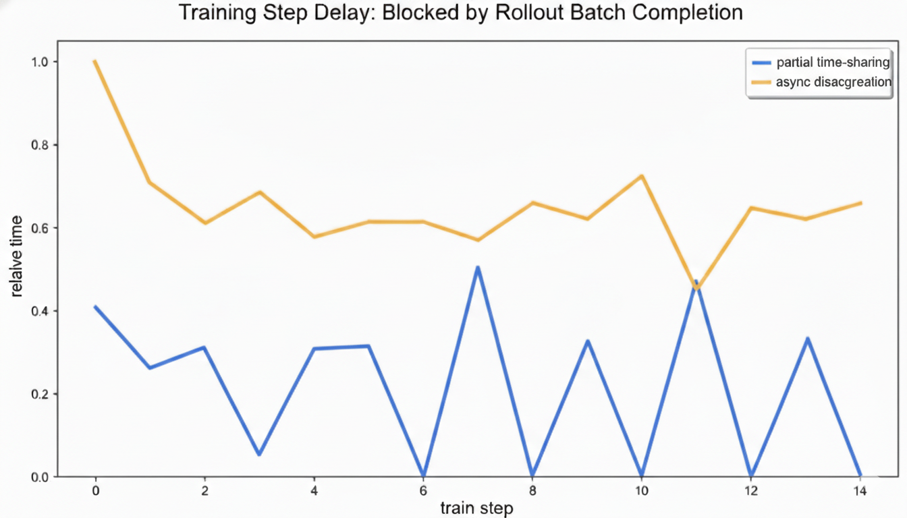

# ROLL 0.2: Minimizing the GPU Resource Bubble in Agentic RL with Partial Time-Sharing

> **TL;DR:** ROLL 0.2 introduces **Partial Time-Sharing**, a dynamic GPU scheduling strategy that dramatically reduces the "Resource Bubble" in large-scale Agentic RL training. Tested in production environment at Alibaba on a **160-GPU cluster** with the **Qwen3-235B-A22B** MoE model, we achieved **~3× faster rollout throughput** and **zero sampling timeouts**. It maintains **semantic equivalence to standard asynchronous training** and requires **no changes to training recipes**.
>
> **[View on GitHub](https://github.com/alibaba/ROLL)** 
---

## The Core Challenge: Rollout Stragglers & Resource Bubbles

As LLMs evolve from static **"thinkers"** to dynamic **"doers"** (Agents) capable of multi-turn, long-horizon task execution, a critical challenge emerges in Reinforcement Learning (RL) for agents: the **straggler effect** in distributed systems.

In distributed RL, rollout workloads commonly exhibit a **long-tail distribution**: most trajectories complete quickly, but a small fraction of complex samples (stragglers) run significantly longer. This creates the **Resource Bubble**, where most GPUs sit idle waiting for the slowest sample to finish.

Unfortunately, Agentic RL makes this problem even worse due to three factors: 
1. **undefined turn count** (the number of multi-turn loops varies unpredictably per task), 
2. **unpredictable token length** (reasoning depth varies wildly per turn), 
3. **external tool latency** (compilers and APIs have highly variable execution time). 

These factors amplify the straggler effect, making naive scheduling strategies prohibitively wasteful.

---

## Scheduling Approaches: From Baseline to Partial Time-Sharing

We compared three scheduling architectures, the first two of which are commonly used today (see Figure 1):

1. **Synchronous Colocation:** Strict serial execution. All GPUs wait for stragglers before switching phases, slow and low GPU utilization.
2. **Asynchronous Disaggregation:** Fixed GPU pools for rollout and training. Creates **"dual bubbles"** where both pools wait for long-tail samples.
3. **Partial Time-Sharing (Ours):** Dynamic allocation. Schedule training into the natural "rollout demand valley" when next rollout batch completes.

*Figure 1: Timeline illustration of Synchronous Colocation, Asynchronous Disaggregation, and Partial Time-Sharing. This timeline shows how training and rollout phases are scheduled and overlapped.*

---

## Implementation: The Two-Phase Dynamic Scheduling
  
The core idea is simple: dynamically switch idle rollout GPUs to training during the sampling phase.

1. **Phase 1: Full Rollout (100% Cluster)**  
   Starts with maximum data parallelism for rollout to clear the prompt backlog.
2. **Phase 2: Parallel Rollout and Training**  
   - **Shrink:** As enough sample batch is collected, a subgroup of GPUs swap inference weights and switch to training. The remaining GPUs continue handling long-tail trajectories.
   - **Parallel Execution:** Training runs in parallel to the rollout.
   - **Expand:** Upon training completion, all rollout workers sync weights and continue the full rollout.

🔧 Engineering Challenges Solved

| Challenge | Solution |
|:---|:---|
| **Fine-grained GPU allocation for rollout** | Extend the one-to-all API to respect subgroup command and context-switching via swapping task states|
| **Distributed Concurrency** | Coordination between agentic rollout loop, the rollout dispatcher and inference engines|
| **Implementation Complexity** | Our own “spec-driven development” approach  [Design-Doc Driven "AI Coding"](https://mp.weixin.qq.com/s/O1gko_wE6foD_c0re28q-w) |

---

## Production-Scale Benchmarks

### Experimental Setup

| Parameter | Value |
|:---|:---|
| **Total GPUs** | 160 |
| **Async Disaggregation Config (Baseline)** | 32 GPUs for Rollout, 128 GPUs for Train |
| **Partial Time-Sharing Config (ROLL v0.2)** | 160 GPUs for Rollout,  128 GPUs for Train (overlapped with) |
| **Model** | Qwen3-235B-A22B (MoE, 235B params, 22B active) |
| **Workload** | SWE-Agentic (100 turns, 64K tokens, 512 batch size) |
| **Async Ratio (Trajectory Staleness Constraint)** | 1  |

### Key Results 

| Metric | Baseline | Partial Time-Sharing | Improvement |
|:---|:---|:---|:---|
| **Relative Training Step Delay** | 0.6 | **0.2** | **~3× Speedup** |
| **Sample Timeout Ratio** | 90% | **~0%** |  **Zero Waste**  |
| **Weight Sync Overhead** | Sub-minute | **Extra few seconds** | **Negligible Overhead** |

Partial Time-Sharing achieves two critical improvements. First, deploying all 160 GPUs for rollout at iteration start accelerates trajectory sampling, reducing the time training must wait for a complete batch, cutting Relative Training Step Delay from 0.6 to 0.2 (translating to a **~3× improvement in rollout throughput**; see Figure 2). Second, this full-cluster parallelism completes sampling before timeout thresholds trigger, **reducing Sample Timeout Ratio from 90% to ~0%** (see Figure 3). 

*Figure 2: Relative training step delay (0.2 vs 0.6) over train steps.*

*Figure 3: Sample timeout ratio over train steps.*

---

## Conclusion & What's Next

**Partial Time-Sharing** reduces GPU idle time by dynamically scheduling training during rollout's natural demand valleys, delivering **~3× rollout throughput**, **~0% timeout ratio**, and **zero-config setup** for large-scale Agentic RL.

ROLL independently proposed and validated the partial time-sharing approach on large-scale production clusters with large MoE models, and **fully open-sourced** this battle-tested solution from Alibaba. We thank **[SeamlessFlow](https://arxiv.org/abs/2508.11553v1)** for sharing their Tag Scheduling work, their concurrent work also validates the effectiveness of this approach.

**Multi-LoRA RL Available Soon!** Inspired by [Tinker API](https://thinkingmachines.ai/tinker), we've extended partial time-sharing to train multiple LoRA adapters within a single RL job for even greater efficiency.

---

## Resources

<!-- todo need example on this -->
- **Quick Start:** [Check usage example](https://github.com/alibaba/ROLL/examaples/todo.yaml)
- **Technical Report (Production Usage of Partial Time-Sharing):** [arXiv](https://arxiv.org/abs/2512.24873) and [Model Weights](https://huggingface.co/FutureLivingLab/iFlow-ROME) 
- **Design-Doc Driven AI Coding:** [Wechat article](https://mp.weixin.qq.com/s/O1gko_wE6foD_c0re28q-w)
- **Join our WeChat Group:** [Stay connected](https://github.com/alibaba/ROLL/blob/main/assets/roll_wechat.png)
- **Follow or DM us on X:** [@FutureLab2025](https://x.com/FutureLab2025)

---

*Last updated: January 31, 2026*

*Keywords: GPU Resource Bubble, Agentic RL Training, Partial Time-Sharing, VRAM Management, Distributed RL Scheduling, Long-Tail Straggler Effect, Dynamic GPU Allocation, Multi-LoRA Training*

