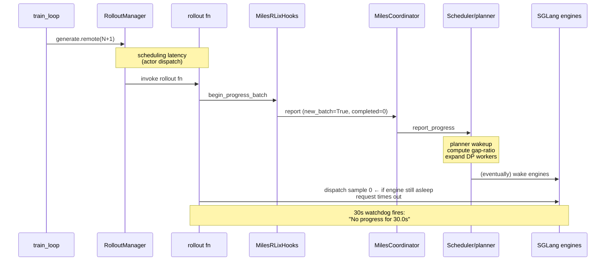
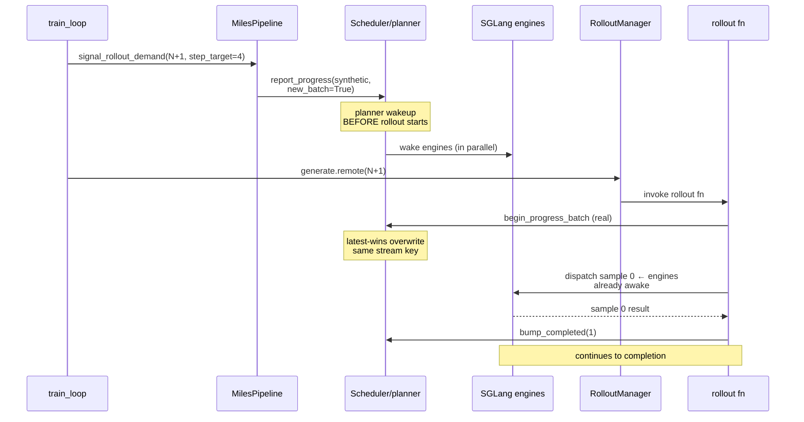

# 4-GPU 2-Pipeline Full Cross-Overlap — Rollout-2+ Hang Fix

> ⚠️ **Internal dev note — not intended for upstream merge.**
> This file lives under `docs/internal/` and is shipped on the
> `tianye/4gpu-2ppl-fix` branch alongside the fix commit, but in
> a separate commit so upstream can cherry-pick the code without
> pulling this note.

Companion doc to `MilesPipeline.signal_rollout_demand` (commit on this
branch). Captures the **why** behind the fix so future readers (and
the inline code comments, which now point here) don't need to
re-derive it from logs.

---

## TL;DR

- **Symptom**: `--num-rollout >= 3` hung on rollout 2's data collection
  with `Warning: No progress for 30.0s. Queue size: 0, Collected: 0/4`.
- **Root cause**: between rollouts, both pipelines' actor_infer DP
  workers shrink to `set()` (actor_train preempts shared infer GPUs).
  The gap-ratio planner only learns the next rollout needs engines
  when the rollout function fires `begin_progress_batch` — but that
  fires from INSIDE the rollout function, AFTER it has started trying
  to dispatch samples. Whichever pipeline reports first wins the
  GENERATION budget; the peer pipeline starves.
- **Fix**: pre-stamp scheduler with a synthetic
  `new_batch=True, completed=0` progress report BEFORE each rollout
  dispatch. Mirrors rlix's verified `full_finetune_pipeline.py:696`
  Phase 4.5 pattern (`notify_release_then_request_gpus`) without
  tearing down miles' SGLang engines.

---

## Topology

```text
        ┌─── GPU 0 ───┐ ┌─── GPU 1 ───┐ ┌─── GPU 2 ───┐ ┌─── GPU 3 ───┐
P1      │  train ●    │ │  train ●    │ │             │ │             │
        │  infer ◐    │ │  infer ◐    │ │  infer ◐    │ │  infer ◐    │
        ├─────────────┤ ├─────────────┤ ├─────────────┤ ├─────────────┤
P2      │             │ │             │ │  train ●    │ │  train ●    │
        │  infer ◐    │ │  infer ◐    │ │  infer ◐    │ │  infer ◐    │
        └─────────────┘ └─────────────┘ └─────────────┘ └─────────────┘
                       ●  ACTOR_TRAINING (priority 0 — preempts infer)
                       ◐  GENERATION (priority 6 — sleeps under preempt)
```

Both pipelines declare `actor_infer = [0,1,2,3]` (full overlap). At
ANY moment, GPUs that a pipeline's `actor_train` is using cannot
serve that pipeline's `actor_infer` — `ACTOR_TRAINING` priority
preempts `GENERATION`. Steady-state interleaving depends on the
gap-ratio planner alternating which pipeline gets infer DP workers
at each rollout boundary.

---

## The chicken-and-egg

Per-rollout state machine on the rlix side, ABRIDGED:

```text
                    ┌─────────────────────────────────────────┐
                    │   rollout N completes _after_training:  │
                    │   actor_train released back to scheduler│
                    │   actor_infer.active_dp_ranks = set()   │
                    │   (was [0] or [1] during rollout N)     │
                    └────────────────────┬────────────────────┘
                                         │
                    ┌────────────────────▼────────────────────┐
                    │ train_loop: rollout_manager.generate    │
                    │            .remote(N+1)  ← FIRE-AND-    │
                    │                            FORGET        │
                    └────────────────────┬────────────────────┘
                                         │
                    ┌────────────────────▼────────────────────┐
                    │ Inside RolloutManager / rollout fn:     │
                    │  step 1) hooks.begin_progress_batch     │
                    │  step 2) for s in samples:              │
                    │            dispatch to engine ← HANGS   │
                    │            here if engine asleep        │
                    └─────────────────────────────────────────┘
```

`begin_progress_batch` → `MilesCoordinator._aggregate_and_emit` →
`scheduler.report_progress(new_batch=True, completed=0,
step_target=4)` is the ONLY fresh demand signal the planner sees
under the old design. So the timeline is:



With **two** pipelines racing at the same rollout boundary, the
first one to land its `begin_progress_batch` wins the budget; the
peer's `begin_progress_batch` lands later, the planner tries to
donor-shrink the first pipeline's DP workers back, but the
asynchronous engine wake on the peer side doesn't complete before
the rollout fn's first sample dispatch times out.

The prior iteration's Layer-1 fix (persisted `step_target_estimate`
on `ClusterAllocation` + v3 peer-signal rule) kept both pipelines
visible to the planner during this window — necessary but not
sufficient. The planner still couldn't ACT until at least one
pipeline reported a fresh signal.

---

## The fix

Mirror rlix's verified Phase 4.5 pattern at
`rlix/pipeline/full_finetune_pipeline.py:696`. Phase 4.5 wraps
`scheduler.notify_release_then_request_gpus(release=actor_train at
prev step, request=actor_infer at GENERATION,
request_step_target_estimate=N)` and runs at the START of every
step, BEFORE the rollout dispatcher gets the GPU list. This stamps
a fresh pending GENERATION request on the scheduler PROACTIVELY,
gives the planner its demand signal, and only THEN runs the rollout.

miles can't release+re-request `actor_infer` per rollout — its
SGLang engines hold a single-process state machine with sleep/wake
semantics, not request/release per step; tearing them down between
rollouts would reset KV caches and break weight-update lineage.

So `signal_rollout_demand` publishes the **synthetic equivalent**:
a `ProgressReport` shaped bit-identical to what
`MilesCoordinator._aggregate_and_emit` produces during a normal
in-rollout `begin_progress_batch` flush:

```python
ProgressReport(
    pipeline_id=self._pipeline_id,
    step_target_trajectories=step_target,         # rollout_batch_size
    metrics={"mode": "aggregated",
             "collected": 0, "completed": 0,
             "bucket": 0,
             "new_batch": True},                  # ← key flag
)
```

`scheduler.report_progress` is "latest wins" overwrite + a
`_wakeup_event.set()`. When the real `begin_progress_batch` lands a
moment later, it cleanly supersedes the synthetic entry — same
stream key (`"aggregated:__fft__"`), same shape, no duplicate
accumulation, no stream-type conflict.



---

## Where the fix lives in this repo

Three additive changes:

| File | Purpose |
|------|---------|
| `rlix/pipeline/miles_pipeline.py` | New `MilesPipeline.signal_rollout_demand(rollout_id, step_target)` method. Posts the synthetic `ProgressReport`. Best-effort (try/except logs WARNING and returns — the in-rollout `begin_progress_batch` remains the correctness baseline). |
| `rlix/client/client.py` | `Orchestrator.options(max_concurrency=4)`. Mitigates the Ray-2.55.1 `worker.py:1039 'Worker' has no attribute 'core_worker'` race that fires more readily under added per-rollout signal traffic. **Mitigation, not elimination** — run 27 confirmed the race can still fire intermittently. |
| `rlix/orchestrator/orchestrator.py` | Same `max_concurrency=4` on the `SchedulerActor`. Scheduler state mutations stay under `self._lock = asyncio.Lock`, so data-hazard-free. Hot-path per-rollout RPC bypasses the Orchestrator entirely (`signal_demand` → scheduler direct). |

Companion changes in `miles@tianye/4gpu-2ppl-fix`:
- `miles/utils/rlix_train_loop.py` — new `signal_demand` step hook
  called pre-pre-loop-dispatch and after every `after_step` before
  dispatching the next rollout.
- `examples/rlix/run_miles_dual.py` — wires the hook to
  `pipe.signal_rollout_demand.remote`.

---

## Why some alternatives were rejected

- **Release + re-request actor_infer per rollout**: rlix's exact
  pattern. Rejected because it tears down SGLang engines mid-loop;
  resetting KV caches and weight-update versioning is heavier than
  the bug.
- **Eager fallback expansion when no peer has signal**: rejected
  by the v3 rule in commit `1c9755a` — eagerly expanding when no
  peer is competing OOMs SGLang's `resume_memory_occupation` if a
  prior non-GEN allocation hasn't physically freed (e.g.
  `MILES_SKIP_TMS_PAUSE=1` no-op offload on blackwell/cu12.9).
- **Bump scheduler `max_restarts`** to recover from the Ray race:
  rejected (commit `1c9755a` review iteration H1). Restarted
  Scheduler loses in-memory state (`_topology_ready` event,
  `active_allocations`, `pipeline_registry`); subsequent calls block
  on `_wait_topology_ready` until timeout.

---

## Verification

`runs/run28-n5-PASS.log` in
`TianyeGGBond/UCBCS188-Intro-to-AI @
rlix-miles-4gpu-2ppl-rollout2-hang-fix` — `--num-rollout 5`, both
pipelines complete cleanly, `EXIT=0`. Prior runs (run 25, run 27)
hung on rollout 2 collection on the same harness.
